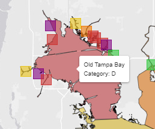
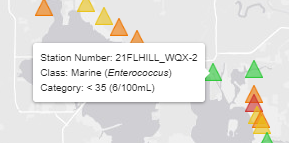
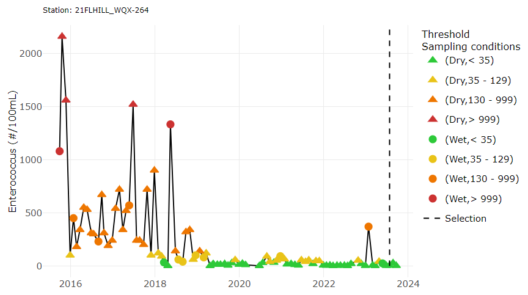
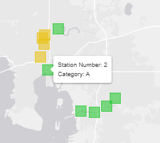
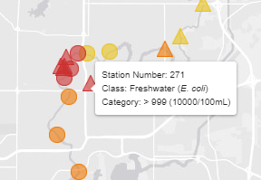
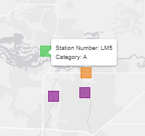
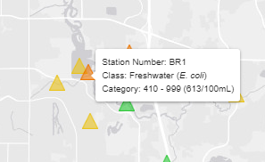
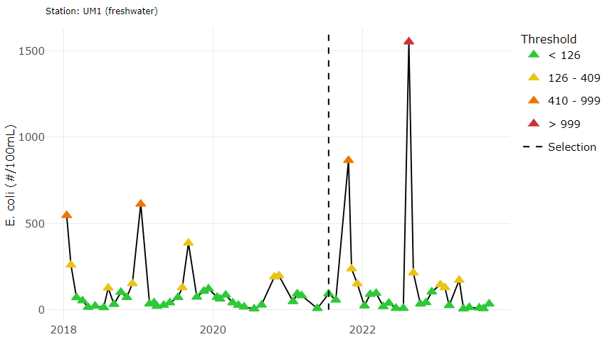

```{r setup, include=F}
knitr::opts_chunk$set(echo = F, message = F, warning = F)

source(here::here('R/global.R'))
source(here::here('R/funcs.R'))
# devtools::load_all('../tbeptools', helpers = F)
```

```{r reactives}
# baywide ent matrix
entmatrix <- reactive({

  # inputs
  areasel1 <- input$areasel1
  segsel1 <- input$segsel1
  yrsel1 <- input$yrsel1
  
  if(!segsel1){
    stas <- enterodata %>%
      dplyr::filter(bay_segment %in% areasel1) %>%
      dplyr::select(station) %>%
      dplyr::distinct() %>%
      dplyr::pull()

    p <- try(tbeptools::show_fibmatrix(enterodata, stas = stas, yrrng = c(yrmin1, maxyr), 
                                       indic = 'entero', warn = F))
  
  }
  
  if(segsel1){

    p <- try(tbeptools::show_fibmatrix(enterodata, stas = NULL, bay_segment = areasel1, 
                                       yrrng = c(yrmin1, maxyr), indic = 'entero', warn = F))
  
  }
 
  validate(
    need(!inherits(p, 'try-error'), 'No enterococcus data available for selection')
  )
  
  out <- mataddyr_fun(p, yrsel = yrsel1)
  
  return(out)
  
})

# data for baywide ent map, yr
yrtomap1 <- reactive({
  
  yrsel1 <- input$yrsel1
  areasel1 <- input$areasel1
  
  req(areasel1)
  
  out <- tbeptools::show_fibmatmap(enterodata, yrsel = yrsel1, areasel = areasel1, 
                                   indic = 'entero', listout = T, warn = F)
  
  return(out)
    
}) 

# baywide ent data to map, yr
observe({

  # inputs
  yrtomap1 <- try(yrtomap1())

  # create map
  if(inherits(yrtomap1, 'try-error'))
    leaflet::leafletProxy("entmapyr") %>%
      leaflet::clearMarkers() |> 
      leaflet::clearShapes()

  if(!inherits(yrtomap1, 'try-error'))
    leaflet::leafletProxy("entmapyr") %>%
      leaflet::clearMarkers() |>
      leaflet::clearShapes() |> 
      leaflet::addMarkers(
        data = yrtomap1$tomapsta,
        lng = ~Longitude,
        lat = ~Latitude,
        icon = ~yrtomap1$icons[as.numeric(cat)],
        label = ~lapply(as.list(lab), tbeptools::util_html)
      ) |> 
      leaflet::addPolygons(
        data = yrtomap1$tomapseg,
        fillColor = ~I(col),
        fillOpacity = 0.5,
        color = 'black',
        weight = 1,
        label = ~lapply(as.list(lab), tbeptools::util_html)
      )

})

# baywide ent data to map, yr mo
enterotomap <- reactive({

   # inputs
  yrsel1 <- input$yrsel1
  mosel1 <- input$mosel1
  areasel1 <- input$areasel1

  req(mosel1)
  
  mosel1 <- mos[[mosel1]]
  areasel <- names(areas1[areas1 %in% areasel1])
  
  tomap <- tbeptools::anlz_enteromap(enterodata, yrsel1, mosel1, areasel, wetdry = TRUE, precipdata = catchprecip, 
                                     temporal_window = 2, wet_threshold = 0.5, assf = T)

  return(tomap)

})

observe({

  # inputs
  enterotomap <- try(enterotomap())

  # create map
  if(inherits(enterotomap, 'try-error'))
    leaflet::leafletProxy('entmap') |> 
      leaflet::clearMarkers() 

  if(!inherits(enterotomap, 'try-error'))
    leaflet::leafletProxy('entmap') |> 
      leaflet::clearMarkers() |>
      leaflet::addMarkers(
        data = enterotomap,
        lng = ~Longitude,
        lat = ~Latitude,
        icon = ~ecocciicons[as.numeric(grp)],
        label = ~lapply(as.list(lab), tbeptools::util_html), 
        layerId = ~station
      )

})

# entmap popup modal
observeEvent(input$entmap_marker_click, {

  showModal(modalDialog(
      plotly::plotlyOutput('entmappopup', height = "500px"),
      easyClose = T,
      fade = F,
      footer = NULL, 
      size = 'l'
    ))

})

# create plot on entmap click
entmappopup <- eventReactive(input$entmap_marker_click, {
  
  yrsel1 <- input$yrsel1
  mosel1 <- input$mosel1
  station <- input$entmap_marker_click$id

  req(mosel1)
  mosel1 <- mos[[mosel1]]
  
  out <- entmappopup_plo(enterowetdry, station, yrsel1, mosel1)
  
  return(out)
  
})

# epc fib matrix
fibmatrix <- reactive({

  # inputs
  areasel2 <- input$areasel2
  yrsel2 <- input$yrsel2
  
  stas <- fibdata %>%
    dplyr::filter(area %in% areasel2) %>%
    dplyr::select(epchc_station) %>%
    dplyr::distinct() %>%
    dplyr::pull()

  p <- try(tbeptools::show_fibmatrix(fibdata, stas = stas, yrrng = c(yrmin2, maxyr), 
                                     indic = 'fcolif', warn = F))
  
  validate(
    need(!inherits(p, 'try-error'), 'No fecal coliform data available for selection')
  )
  
  out <- mataddyr_fun(p, yrsel = yrsel2)
    
  return(out)
  
})

# data for epc fib map, yr
yrtomap2 <- reactive({
  
  yrsel2 <- input$yrsel2
  areasel2 <- input$areasel2
  
  req(areasel2)
  
  out <- tbeptools::show_fibmatmap(fibdata, yrsel = yrsel2, areasel = areasel2, 
                                   indic = 'fcolif', listout = T, warn = F)
  
  return(out)
    
}) 

# epc fib data to map, yr
observe({

  # inputs
  yrtomap2 <- try(yrtomap2())

  # create map
  if(inherits(yrtomap2, 'try-error'))
    leaflet::leafletProxy("fibmapyr") %>%
      leaflet::clearMarkers() |> 
      leaflet::clearShapes()

  if(!inherits(yrtomap2, 'try-error'))
    leaflet::leafletProxy("fibmapyr") %>%
      leaflet::clearMarkers() |>
      leaflet::clearShapes() |> 
      leaflet::addMarkers(
        data = yrtomap2$tomapsta,
        lng = ~Longitude,
        lat = ~Latitude,
        icon = ~yrtomap2$icons[as.numeric(cat)],
        label = ~lapply(as.list(lab), tbeptools::util_html)
      )

})

# epc fib data to map, yr mo
fibtomap <- reactive({

  # inputs
  yrsel2 <- input$yrsel2
  mosel2 <- input$mosel2
  areasel2 <- input$areasel2

  req(mosel2)
  
  mosel2 <- mos[[mosel2]]
  
  tomap <- tbeptools::anlz_fibmap(fibdata, yrsel2, mosel2, areasel2, assf = T)
  
  return(tomap)
  
})

# epc fib map
observe({

  # inputs
  fibtomap <- try(fibtomap())

  # create map
  if(inherits(fibtomap, 'try-error'))
    leaflet::leafletProxy('fibmap') |> 
      leaflet::clearMarkers()
  
  if(!inherits(fibtomap, 'try-error'))
    leaflet::leafletProxy('fibmap') |> 
      leaflet::clearMarkers() |> 
      leaflet::addMarkers(
        data = fibtomap,
        lng = ~Longitude,
        lat = ~Latitude,
        icon = ~fibicons[as.numeric(grp)],
        label = ~lapply(as.list(lab), tbeptools::util_html), 
        layerId = ~station
      )
    
})

# fibmap popup modal
observeEvent(input$fibmap_marker_click, {

  showModal(modalDialog(
      plotly::plotlyOutput('fibmappopup', height = "500px"),
      easyClose = T,
      fade = F,
      footer = NULL, 
      size = 'l'
    ))

})

# create plot on fibmap click
fibmappopup <- eventReactive(input$fibmap_marker_click, {
  
  yrsel2 <- input$yrsel2
  mosel2 <- input$mosel2
  station <- input$fibmap_marker_click$id

  req(mosel2)
  mosel2 <- mos[[mosel2]]
  
  out <- fibmappopup_plo(fibdata, station, yrsel2, mosel2)
  
  return(out)
  
})

# manco fib matrix
mancofibmatrix <- reactive({

  # inputs
  areasel3 <- input$areasel3
  yrsel3 <- input$yrsel3
  
  stas <- mancofibdata %>%
    dplyr::filter(area %in% areasel3) %>%
    dplyr::select(manco_station) %>%
    dplyr::distinct() %>%
    dplyr::pull()

  p <- try(tbeptools::show_fibmatrix(mancofibdata, stas = stas, yrrng = c(yrmin3, maxyr), 
                                     indic = 'fcolif', warn = F))
  
  validate(
    need(!inherits(p, 'try-error'), 'No fecal coliform data available for selection')
  )
  
  out <- mataddyr_fun(p, yrsel = yrsel3)
    
  return(out)
  
})

# data for manco fib map, yr
yrtomap3 <- reactive({
  
  yrsel3 <- input$yrsel3
  areasel3 <- input$areasel3
  
  req(areasel3)
  
  out <- tbeptools::show_fibmatmap(mancofibdata, yrsel = yrsel3, areasel = areasel3, 
                                   indic = 'fcolif', listout = T, warn = F)
  
  return(out)
    
}) 

# manco fib data to map, yr
observe({

  # inputs
  yrtomap3 <- try(yrtomap3())

  # create map
  if(inherits(yrtomap3, 'try-error'))
    leaflet::leafletProxy("mancofibmapyr") %>%
      leaflet::clearMarkers() |> 
      leaflet::clearShapes()

  if(!inherits(yrtomap3, 'try-error'))
    if(nrow(yrtomap3$tomapsta) == 0)
      leaflet::leafletProxy("mancofibmapyr") %>%
        leaflet::clearMarkers() |> 
        leaflet::clearShapes()
    else
      leaflet::leafletProxy("mancofibmapyr") %>%
        leaflet::clearMarkers() |>
        leaflet::clearShapes() |> 
        leaflet::addMarkers(
          data = yrtomap3$tomapsta,
          lng = ~Longitude,
          lat = ~Latitude,
          icon = ~yrtomap3$icons[as.numeric(cat)],
          label = ~lapply(as.list(lab), tbeptools::util_html)
        )

})

# manco fib data to map, yr mo
mancofibtomap <- reactive({

  # inputs
  yrsel3 <- input$yrsel3
  mosel3 <- input$mosel3
  areasel3 <- input$areasel3

  req(mosel3)
  
  mosel3 <- mos[[mosel3]]

  tomap <- tbeptools::anlz_fibmap(mancofibdata, yrsel3, mosel3, areasel3, assf = T)
  
  return(tomap)
  
})

# manco fib map
observe({

  # inputs
  mancofibtomap <- try(mancofibtomap())

  # create map
  if(inherits(mancofibtomap, 'try-error'))
    leaflet::leafletProxy('mancofibmap') |> 
      leaflet::clearMarkers()

  if(!inherits(mancofibtomap, 'try-error'))
    leaflet::leafletProxy('mancofibmap') |> 
      leaflet::clearMarkers() |> 
      leaflet::addMarkers(
        data = mancofibtomap,
        lng = ~Longitude,
        lat = ~Latitude,
        icon = ~fibicons[as.numeric(grp)],
        label = ~lapply(as.list(lab), tbeptools::util_html), 
        layerId = ~station
      )
    
})

# manco fibmap popup modal
observeEvent(input$mancofibmap_marker_click, {

  showModal(modalDialog(
      plotly::plotlyOutput('mancofibmappopup', height = "500px"),
      easyClose = T,
      fade = F,
      footer = NULL, 
      size = 'l'
    ))

})

# create plot on manco fibmap click
mancofibmappopup <- eventReactive(input$mancofibmap_marker_click, {
  
  yrsel3 <- input$yrsel3
  mosel3 <- input$mosel3
  station <- input$mancofibmap_marker_click$id

  req(mosel3)
  mosel3 <- mos[[mosel3]]

  out <- fibmappopup_plo(mancofibdata, station, yrsel3, mosel3)
  
  return(out)
  
})

# download data
dldat <- reactive({
  
  typseldl <- input$typseldl
  yrseldl <- input$yrseldl
  
  req(yrseldl)
  
  out <- dldatproc_fun(typseldl, yrseldl)
  
  return(out)
  
})
  
# reactable table
dltab <- reactive({
  
  dldat <- dldat()

  out <- dldattab_fun(dldat)
  
  return(out)
  
})
```

```{r output}
# baywide ent matrix
output$entmatrix <- plotly::renderPlotly(entmatrix())

# baywide ent map, yr
output$entmapyr <- leaflet::renderLeaflet({

  tbeptools::show_fibmatmap(enterodata, yrsel = maxyr, 
                            areasel = c('OTB', 'HB', 'MTB', 'LTB', 'BCB', 'MR'),
                            precipdata = catchprecip, indic = 'entero', warn = F)

})

# baywide ent map, yr mo
output$entmap <- leaflet::renderLeaflet({

  tbeptools::show_enteromap(enterodata, yrsel = maxyr, mosel = 7, areasel = c('Hillsborough Bay', 'Old Tampa Bay', 'Middle Tampa Bay', 'Lower Tampa Bay', 'Boca Ciega Bay', 'Manatee River'),
                            wetdry = T, precipdata = catchprecip, temporal_window = 2, wet_threshold = 0.5)

})

# epc fib matrix
output$fibmatrix <- plotly::renderPlotly(fibmatrix())

# epc fib map, yr
output$fibmapyr <- leaflet::renderLeaflet({

  tbeptools::show_fibmatmap(fibdata, yrsel = maxyr, 
                            areasel = c('Alafia River', 'Hillsborough River'),
                            precipdata = catchprecip, indic = 'fcolif', warn = F)

})

# epc fib map, yr mo
output$fibmap <- leaflet::renderLeaflet({

  tbeptools::show_fibmap(fibdata, yrsel = maxyr, mosel = 7, 
                         areasel = c('Alafia River', 'Hillsborough River'))

})

# manco fib matrix
output$mancofibmatrix <- plotly::renderPlotly(mancofibmatrix())

# manco fib map, yr
output$mancofibmapyr <- leaflet::renderLeaflet({

  tbeptools::show_fibmatmap(mancofibdata, yrsel = maxyr - 2, 
                            areasel = c('Braden River', 'Manatee River'),
                            precipdata = catchprecip, indic = 'fcolif', warn = F)

})

# manco fib map, yr mo
output$mancofibmap <- leaflet::renderLeaflet({

  tbeptools::show_fibmap(mancofibdata, yrsel = maxyr - 2, mosel = 7, 
                         areasel = c('Braden River', 'Manatee River'))

})

# year slider range for download
output$yrseldl <- renderUI({
  
  typseldl <- input$typseldl
  
  if(!grepl('Hillsborough|Manatee', typseldl))
    minyr <- yrmin1
  if(grepl('Hillsborough', typseldl))
    minyr <- yrmin2
  if(grepl('Manatee', typseldl))
    minyr <- yrmin3
  
    sliderInput('yrseldl', 'Select year range:', min = minyr, max = maxyr, value = c(minyr, maxyr), step = 1, sep = '', width = '200%')
  
})
```

```{r downloadhandlers}
# download fib table
output$dwnld <- downloadHandler(
  filename = function(){'downloaddata.csv'},
  content = function(file){

    # inputs
    dldat <- dldat()

    write.csv(dldat, file, quote = T, row.names = F)

  }
)
```

OVERVIEW
===========================================================

Column {.tabset .tabset-fade data-width=650}
-----------------------------------------------------------------------

### USING THE DASHBOARD

<div class = "row">
<div class = "col-md-2"></div>
<div class = "col-md-8">

#### WELCOME TO THE TAMPA BAY FIB DASHBOARD!

```{r, echo = F, out.width = '100%', fig.align = 'center'}

```

This dashboard summarizes fecal indicator bacteria (FIB) data for a baywide assessment and for data collected as part of the Environmental Protection Commission of Hillsborough County (EPCHC) monitoring program.  The latter is specific to evaluating fecal impairments in the Hillsborough and Alafia river basins.  The assessments are meant to inform progress remediating fecal impairments or to support prioritization of areas for further investigation. They are not meant to support beach monitoring efforts or closures for recreational uses - alternative reporting products are available for that purpose (see [FLDOH Healthy Beaches](https://www.floridahealth.gov/environmental-health/beach-water-quality/county-detail.html?County=Pinellas&Zip=33701-3109){target="_blank"} and [Pinellas County Recreational Water Quality Map](https://pinellas.wateratlas.usf.edu/maps/coastal-water-quality-map/){target="_blank"}). The dashboard is organized in the following sections:

1) [__BAYWIDE__](#baywide): View baywide summaries of *Enterococcus* data at select monitoring locations for each bay segment
1) [__HILLSBOROUGH COUNTY__](#hillsborough-county): View summaries of Environmental Protection Commission of Hillsborough County (EPCHC) FIB data for the Hillsborough and Alafia River basins
1) [__MANATEE COUNTY__](#manatee-county): View summaries of Manatee County FIB data for select monitoring locations
1) [__DATA DOWNLOADS__](#data-downloads): Download baywide, Hillsborough County, or Manatee County data

The plots in this dashboard are interactive and display options can be controlled using a mouse. Most plots include a [control menu](https://help.plot.ly/zoom-pan-hover-controls/){target="_blank"} on the top with different options for viewing the data.  For example, click the camera icon to download a plot.

<br>
```{r, fig.align='center', out.width='30%'}

```
<br>

#### Data sources

Source data used on this website were obtained from multiple sources for the baywide assessment and from the Environmental Protection Commission of Hillsborough County. Data can be obtained using functions from the tbeptools R package described below. Graphics and tables provided on the dashboard are made available for exploratory purposes only.  

#### Website information

<a href="https://tbep-tech.github.io/tbeptools/articles/fib.html" target="__blank" rel="noopener noreferrer"></a>

The page source content can be viewed on [Github](https://github.com/tbep-tech/fib-dash){target="_blank"}. Nearly all of the data, tables, and plots were created using functions in the [tbeptools](https://tbep-tech.github.io/tbeptools){target="_blank"} R software package.  Please see the [vignette](https://tbep-tech.github.io/tbeptools/articles/fib.html){target="_blank"} for a detailed overview of how you can use these functions on your own to work with the data. 

Questions and comments about the dashboard can be sent to [Marcus Beck](mailto:mbeck@tbep.org). Like this app? Share it on social media using the [\#TampaBayOpenSci](https://twitter.com/hashtag/TampaBayOpenSci?src=hashtag_click){target="_blank"} hashtag.  

Citation info here: [](https://doi.org/10.5281/zenodo.13881473){target="_blank"}

<a rel='license' href='http://creativecommons.org/licenses/by/4.0/' target='_blank'></a>&nbsp;&nbsp;This website is licensed under a <a rel='license' href='http://creativecommons.org/licenses/by/4.0/' target='_blank'>Creative Commons Attribution 4.0 International License</a>.

</div>
<div class = "col-md-2"></div>
</div>

### METHODS

<div class = "row">
<div class = "col-md-2"></div>
<div class = "col-md-8">

#### How to understand and use the dashboard

Fecal Indicator Bacteria (FIB) provide information on the potential exposure risk from contact recreation or fish/shellfish consumption from surface waters with high fecal loads.  These indicators are imperfect and provide only a general overview of the potential risk.  Presence of FIBs does not necessarily indicate the presence of fecal pathogens, but their presence can be used to prioritize areas for further investigation or remediation. 

The FIBs used in this dashboard are *Enterococcus* cell concentrations for the baywide assessment and a mix of pathogens for the EPCHC data. For the latter, these include fecal coliform for the report card and fecal coliform, *Enterococcus*, and *E. Coli* for the map summaries depending on which map is shown.

#### Report card score categories

The report cards on each page use similar methods for defining overall risk categories for the FIBs.  The scores are applied to individual monitoring stations or as a baywide total and describe the likelihood that the samples in a given year exceed a relevant cell concentration threshold.  The thresholds are 400 CFU / 100 mL of *Enterococcus* for the baywide assessments and 130 CFU / 100 mL of fecal coliform for the EPCHC and Manatee County assessments. The score categories are as follows: 

* <span style="color:#2DC938">__A__</span>: < 10% likelihood that the samples exceed the threshold
* <span style="color:#E9C318">__B__</span>: 10-30% likelihood that the samples exceed the threshold
* <span style="color:#EE7600">__C__</span>: 30-50% likelihood that the samples exceed the threshold
* <span style="color:#CC3231">__D__</span>: 50-75% likelihood that the samples exceed the threshold
* <span style="color:#800080">__E__</span>: > 75% likelihood that the samples exceed the threshold

For the baywide assessments, the score categories are assigned to both individual stations and for each bay segment, whereas scores are only assigned to stations for the EPCHC data.  The stations for the baywide assessments were chosen specifically as downstream endpoints that drain directly into each bay segment, whereas the EPCHC and Manatee County stations are more distributed throughout the watershed.  The bay segment score categories are based on the aggregate of all samples from each station that drain into that segment.

#### Map summaries

The maps on each tab show year or year/month summaries for FIBs.  The annual maps show the same score categories for the report cards described above for each station and bay segment for the baywide assessments and for stations only for the EPCHC and Manatee County data. 

The year/month maps show the sample results for each station for a more detailed view of the data in each year.  The year/month summaries show the concentrations at each station using different threshold categories than the scores described above and separate the data differently depending on the dataset. 

The baywide dataset year/month maps show *Enterococcus* concentrations separately as wet or dry samples based on whether a sample was collected after a significant amount of rain occurred prior to sampling or if dry conditions were observed.  The thresholds below are then applied to both wet/dry samples:

* <span style="color:#2DC938">__Green__</span>: Cell concentrations < 35 CFU / 100 mL
* <span style="color:#E9C318">__Yellow__</span>: Cell concentrations 35 - 129 CFU / 100 mL
* <span style="color:#EE7600">__Orange__</span>: Cell concentrations 130 - 999 CFU / 100 mL
* <span style="color:#CC3231">__Red__</span>: Cell concentrations > 999 CFU / 100 mL

Similar thresholds are applied to station samples for the year/month maps for the EPCHC and Manatee County data.  However, samples are not distinguished as wet/dry and the FIB varies depending on the location of the sample.  *Enterococcus* is used for tidally-influenced locations and *E. coli* is used for freshwater locations.

Tidally-influenced *Enterococcus* thresholds for EPCHC/Manatee County year/month maps: 

* <span style="color:#2DC938">__Green__</span>: Cell concentrations < 35 CFU / 100 mL
* <span style="color:#E9C318">__Yellow__</span>: Cell concentrations 35 - 129 CFU / 100 mL
* <span style="color:#EE7600">__Orange__</span>: Cell concentrations 130 - 999 CFU / 100 mL
* <span style="color:#CC3231">__Red__</span>: Cell concentrations > 999 CFU / 100 mL

Freshwater *E. coli* thresholds for EPCHC/Manatee County year/month maps: 

* <span style="color:#2DC938">__Green__</span>: Cell concentrations < 126 CFU / 100 mL
* <span style="color:#E9C318">__Yellow__</span>: Cell concentrations 126 - 409 CFU / 100 mL
* <span style="color:#EE7600">__Orange__</span>: Cell concentrations 410 - 999 CFU / 100 mL
* <span style="color:#CC3231">__Red__</span>: Cell concentrations > 999 CFU / 100 mL

</div>
<div class = "col-md-2"></div>
</div>

1 BAYWIDE {data-navmenu="PAGE SELECTION"}
===========================================================

```{r}
column(12, 
  column(4,
    sliderInput('yrsel1', 'Select year:', min = yrmin1, max = maxyr, value = maxyr, step = 1, sep = '', width = '200%')
    ),
  column(8,
    selectInput('areasel1', 'Select area:', choices = areas1, selected = c('HB', 'OTB', 'MTB', 'LTB', 'BCB', 'MR'), width = '400%', multiple = T)
  )
)
```

Column {.tabset .tabset-fade data-width=275}
-----------------------------------------------------------------------

### REPORT CARD

```{r}
fillCol(flex = c(NA, 1),
  column(12,
    shinyWidgets::materialSwitch('segsel1', 'By bay segment?', value = T, width = '100%')
  ),
  plotly::plotlyOutput('entmatrix')
)
```

### Using this tab

The report card and maps are based on *Enterococcus* cell concentrations with results for bay segments and individual sampling stations. Please view the __METHODS__ tab on the [__OVERVIEW__](#overview) page for a description of the score categories in the report card and the map summaries. 

The displayed data for all of the graphics on this page can be selected using the year slider and area selections at the top.  The year/month map tab includes an additional month slider.  By default, all areas are shown.  To remove an area, select it from the menu and hit the backspace key.

The __REPORT CARD__ tab shows the overall score category each year for sampled locations in the bay.  The row for the selected year from the slider at the top of the page is outlined in black. By default, the bay segment scores are shown. The bay segment abbreviations are as follows: 

* __OTB__: Old Tampa Bay
* __HB__: Hillsborough Bay
* __MTB__: Middle Tampa Bay
* __BCB__: Boca Ciega Bay
* __LTB__: Lower Tampa Bay
* __MR__: Manatee River

Stations that apply to each bay segment can be shown instead by toggling the switch above the report card.

The report card is also interactive and can be zoomed by clicking the mouse and dragging to an area of interest.  Reset the plot by double-clicking.  An image of the report card can be saved by clicking the camera icon that is shown above the report card when the cursor is over the plot. 

The __MAP BY YEAR__ tab shows a map of the report card grades assigned each bay segment and the individual station grades for the selected year. These are the same values shown in the report card.

Placing the cursor over a bay segment or station will reveal additional information. 

<br>
```{r, out.width='30%', fig.align='center'}

```
<br>

The __MAP BY YEAR AND MONTH__ tab shows a map of *Enterococcus* concentration categories for the selected year and month. Samples are identified as occurring during wet (circles) or dry (triangles) conditions. See the __METHODS__ tab on the [__OVERVIEW__](#overview) page for a description of the concentration thresholds.

Placing the cursor over a bay segment or station will reveal additional information. 

<br>
```{r, out.width='40%', fig.align='center'}

```
<br>

Finally, clicking on a station on the year/month map will create an interactive popup plot for the complete time series of *Enterococcus* concentrations at that location.  The popup plot can be closed by clicking outside the plot area.

<br>
```{r, out.width='100%', fig.align='center'}

```
<br>

Column {.tabset .tabset-fade data-width=500}
-----------------------------------------------------------------------

### MAP BY YEAR

```{r}
leaflet::leafletOutput('entmapyr')
```

### MAP BY YEAR AND MONTH

```{r}
output$entmappopup <- plotly::renderPlotly(entmappopup())
fillCol(flex = c(NA, 1),
  column(12,
    column(4, 
      shinyWidgets::sliderTextInput('mosel1', 'Select month:', choices = names(mos), selected = 'Jul', force_edges = T, grid = T, width = '200%')
    ),
    column(8, 'Click on a station to view a complete time series')
  ),
  leaflet::leafletOutput('entmap')
)
```

2 HILLSBOROUGH COUNTY {data-navmenu="PAGE SELECTION"}
===========================================================

```{r}
column(12,
  column(4, 
      sliderInput('yrsel2', 'Select year:', min = yrmin2, max = maxyr, value = maxyr, step = 1, sep = '', width = '200%')
  ), 
  column(8,
    selectInput('areasel2', 'Select area:', choices = areas2, selected = c('Hillsborough River', 'Alafia River'), width = '400%', multiple = T)     
  )
)
```

Column {.tabset .tabset-fade data-width=275}
-----------------------------------------------------------------------

### REPORT CARD

```{r}
plotly::plotlyOutput('fibmatrix')
```

### Using this tab

The report card and maps are based on fecal coliform, *Enterococcus*, and *E. Coli* cell concentrations using EPCHC data with results for individual sampling stations. Please view the __METHODS__ tab on the [__OVERVIEW__](#overview) page for a description of the score categories in the report card and the map summaries. 

The displayed data for all of the graphics on this page can be selected using the year slider and area selections at the top.  The year/month map tab includes an additional month slider. By default, only sampling stations in the Hillsborough and Alafia River tributary watersheds are shown. These were chosen based on state-designated bacterial impairments and efforts under the Basin Management Action Plans (BMAPs). Add more sampling areas from the dropdown menu. To remove an area, select it from the menu and hit the backspace key.

The __REPORT CARD__ tab shows the overall score category each year for fecal coliform concentrations at stations in the EPCHC dataset.  The row for the selected year from the slider at the top of the page is outlined in black. The stations apply to the areas chosen from the drop down at the top of the page. Bay segment summaries cannot be shown for the EPCHC because the stations represent broader sampling areas in the watershed.

The report card is also interactive and can be zoomed by clicking the mouse and dragging to an area of interest.  Reset the plot by double-clicking.  An image of the report card can be saved by clicking the camera icon that is shown above the report card when the cursor is over the plot. 

The __MAP BY YEAR__ tab shows a map of the report card grades assigned to each individual station for the selected year. These are the same values shown in the report card using fecal coliform concentrations.

Placing the cursor over a station will reveal additional information. 

<br>
```{r, out.width='40%', fig.align='center'}

```
<br>

The __MAP BY YEAR AND MONTH__ tab shows a map of *Enterococcus* and *E. Coli* concentration categories for the selected year and month. Tidally-influenced sampling stations use *Enterococcus* (circles) and freshwater sampling stations use *E. coli* (triangles). See the __METHODS__ tab on the [__OVERVIEW__](#overview) page for a description of the concentration thresholds.

Placing the cursor over a station will reveal additional information. 

<br>
```{r, out.width='40%', fig.align='center'}

```
<br>

Finally, clicking on a station on the year/month map will create an interactive popup plot for the complete time series of *Enterococcus* or *E. Coli* concentrations at that location. The popup plot can be closed by clicking outside the plot area.

<br>
```{r, out.width='100%', fig.align='center'}
knitr::include_graphics('www/epchcmodalex.png')
```
<br>

Column {.tabset .tabset-fade data-width=500}
-----------------------------------------------------------------------

### MAP BY YEAR

```{r}
leaflet::leafletOutput('fibmapyr')
```

### MAP BY YEAR AND MONTH

```{r}
output$fibmappopup <- plotly::renderPlotly(fibmappopup())
fillCol(flex = c(NA, 1),
  column(12,
    column(4, 
      shinyWidgets::sliderTextInput('mosel2', 'Select month:', choices = names(mos), selected = 'Jul', force_edges = T, grid = T, width = '200%')
    ),
    column(8, 'Click on a station to view a complete time series')
  ),
  leaflet::leafletOutput('fibmap')
)
```

3 MANATEE COUNTY {data-navmenu="PAGE SELECTION"}
===========================================================

```{r}
column(12,
  column(4, 
      sliderInput('yrsel3', 'Select year:', min = yrmin3, max = maxyr, value = maxyr - 2, step = 1, sep = '', width = '200%')
  ), 
  column(8,
    selectInput('areasel3', 'Select area:', choices = areas3, selected = c('Braden River', 'Manatee River'), width = '400%', multiple = T)     
  )
)
```

Column {.tabset .tabset-fade data-width=275}
-----------------------------------------------------------------------

### REPORT CARD

```{r}
plotly::plotlyOutput('mancofibmatrix')
```

### Using this tab

The report card and maps are based on fecal coliform, *Enterococcus*, and *E. Coli* cell concentrations using Manatee County data with results for individual sampling stations. Please view the __METHODS__ tab on the [__OVERVIEW__](#overview) page for a description of the score categories in the report card and the map summaries. 

The displayed data for all of the graphics on this page can be selected using the year slider and area selections at the top.  The year/month map tab includes an additional month slider. By default, only sampling stations in the Braden and Manatee Rivers are shown. Add more sampling areas from the dropdown menu. To remove an area, select it from the menu and hit the backspace key.

The __REPORT CARD__ tab shows the overall score category each year for fecal coliform concentrations at stations in the Manatee County dataset.  The row for the selected year from the slider at the top of the page is outlined in black. The stations apply to the areas chosen from the drop down at the top of the page. Bay segment summaries cannot be shown for the Manatee County data because the stations represent broader sampling areas not appriopriate for evaluating bay segments.

The report card is also interactive and can be zoomed by clicking the mouse and dragging to an area of interest.  Reset the plot by double-clicking.  An image of the report card can be saved by clicking the camera icon that is shown above the report card when the cursor is over the plot. 

The __MAP BY YEAR__ tab shows a map of the report card grades assigned to each individual station for the selected year. These are the same values shown in the report card using fecal coliform concentrations.

Placing the cursor over a station will reveal additional information. 

<br>
```{r, out.width='40%', fig.align='center'}

```
<br>

The __MAP BY YEAR AND MONTH__ tab shows a map of *Enterococcus* and *E. Coli* concentration categories for the selected year and month. Tidally-influenced sampling stations use *Enterococcus* (circles) and freshwater sampling stations use *E. coli* (triangles). See the __METHODS__ tab on the [__OVERVIEW__](#overview) page for a description of the concentration thresholds.

Placing the cursor over a station will reveal additional information. 

<br>
```{r, out.width='40%', fig.align='center'}

```
<br>

Finally, clicking on a station on the year/month map will create an interactive popup plot for the complete time series of *Enterococcus* or *E. Coli* concentrations at that location. The popup plot can be closed by clicking outside the plot area.

<br>
```{r, out.width='100%', fig.align='center'}

```
<br>

Column {.tabset .tabset-fade data-width=500}
-----------------------------------------------------------------------

### MAP BY YEAR

```{r}
leaflet::leafletOutput('mancofibmapyr')
```

### MAP BY YEAR AND MONTH

```{r}
output$mancofibmappopup <- plotly::renderPlotly(mancofibmappopup())
fillCol(flex = c(NA, 1),
  column(12,
    column(4, 
      shinyWidgets::sliderTextInput('mosel3', 'Select month:', choices = names(mos), selected = 'Jul', force_edges = T, grid = T, width = '200%')
    ),
    column(8, 'Click on a station to view a complete time series')
  ),
  leaflet::leafletOutput('mancofibmap')
)
```

4 DATA DOWNLOADS {data-navmenu="PAGE SELECTION"}
===========================================================

Column {.tabset .tabset-fade data-width=650}
-----------------------------------------------------------------------

### DOWNLOAD

```{r}
output$dltabout <- reactable::renderReactable(dltab())
fillCol(flex =c(NA, 1, NA),
  column(12,
    column(6, 
      selectInput('typseldl', 'Select type:', choices = c('Baywide segment score categories', 'Baywide station score categories', 'Baywide raw data', 'Hillsborough County station score categories', 'Hillsborough County raw data', 'Manatee County station score categories', 'Manatee County raw data'), width = '200%')
    ),
    column(6,
      uiOutput('yrseldl')
    )
  ),
  reactable::reactableOutput('dltabout'),
  shinyWidgets::downloadBttn('dwnld', 'Download data', style = 'simple', block = T, color = 'success')
)
```

### METADATA

Summarized score categories or raw FIB data are described below with each dataset described based on the download options in the previous tab. Data provided on the dashboard are made available for exploratory purposes only.

__Baywide segment score categories__: Tampa Bay FIB score categories summarized by bay segment  

* *Year*: Year of the assessment
* *bay_segment*: Abbreviated name for the bay segment
     * *OTB*: Old Tampa Bay
     * *HB*: Hillsborough Bay
     * *MTB*: Middle Tampa Bay
     * *LTB*: Lower Tampa Bay
     * *BCB*: Boca Ciega Bay
     * *MR*: Manatee River
* *Geometric mean*: Geometric mean of *Enterococcus* cell concentrations #/100 mL
* *Score category*: A, B, C, D, or E from Microbial Water Quality Assessment (MWQA) categories, where breakpoints are <10%, 10-30%, 30-50%, 50-75%, and >75% as the likelihood of exceeding 130 CFU / 100 mL for *Enterococcus* in a given year.

__Baywide station score categories__: Tampa Bay FIB score categories summarized by station 

* *Year*: Year of the assessment
* *Station*: Station name
* *Geometric mean*: Geometric mean of *Enterococcus* cell concentrations #/100 mL
* *Latitude*: Station latitude, WGS84
* *Longitude*: Station longitude, WGS84
* *Score category*: A, B, C, D, or E from Microbial Water Quality Assessment (MWQA) categories, where breakpoints are <10%, 10-30%, 30-50%, 50-75%, and >75% as the likelihood of exceeding 130 CFU / 100 mL for *Enterococcus* in a given year. 

__Baywide raw data__: Raw FIB data for Tampa Bay

* *date*: Date of the sample
* *Year*: Year of the sample
* *Month*: Month of the sample
* *bay_segment*: Abbreviated name for the bay segment
     * *OTB*: Old Tampa Bay
     * *HB*: Hillsborough Bay
     * *MTB*: Middle Tampa Bay
     * *LTB*: Lower Tampa Bay
     * *BCB*: Boca Ciega Bay
     * *MR*: Manatee River
* *Station*: Station name
* *entero*: *Enterococcus* cell concentration, #/100 mL
* *entero_censored*: logical if the value in *entero* is at the MDL
* *MDL*: Method detection limit for *Enterococcus*, #/100 mL
* *entero_units*: Units for the *Enterococcus* cell concentration
* *Latitude*: Station latitude, WGS84
* *Longitude*: Station longitude, WGS84

__Hillsborough County station score categories__: Hillsborough County FIB score categories summarized by station

* *Year*: Year of the assessment
* *Station*: Hillsborough County station name
* *Geometric mean*: Geometric mean of fecal coliform cell concentrations
* *Latitude*: Station latitude, WGS84
* *Longitude*: Station longitude, WGS84
* *Score category*: A, B, C, D, or E from Microbial Water Quality Assessment (MWQA) categories, where breakpoints are <10%, 10-30%, 30-50%, 50-75%, and >75% as the likelihood of exceeding 400 CFU / 100 mL for fecal coliform in a given year. 

__Hillsborough County raw data__: Raw Hillsborough County FIB data

* *area*: Hillsborough County sampling area - Alafia River, Alafia River Tributary, Big Bend, Cockroach Bay, Cockroach Bay Tributary, East Lake Outfall, Hillsborough Bay,  Hillsborough Bay Tributary, Hillsborough River, Hillsborough River Tributary, Lake Roberta, Lake Thonotosassa, Lake Thonotosassa Tributary, Little Manatee River, Little Manatee River Tributary, Lower Tampa Bay, McKay Bay, McKay Bay Tributary, Middle Tampa Bay, Middle Tampa Bay Tributary, Old Tampa Bay, Old Tampa Bay Tributary, Palm River, Palm River Tributary, Tampa Bypass Canal, Tampa Bypass Canal Tributary, Valrico Lake
* *Station*: Hillsborough County station name
* *class*: Water body class as fresh (3F, 1) or tidal (3M, 2)
* *SampleTime*: Time of sample
* *Year*: Year of sample
* *Month*: Month of sample
* *Latitude*: Station latitude, WGS84
* *Longitude*: Station longitude, WGS84
* *ecoli*: *E. coli* cell concentration as #/100 mL
* *ecoli_q*: *E. coli* cell concentration quality flag, see qualifier description tab [here](https://epcbocc.sharepoint.com/:x:/r/sites/Share/_layouts/15/Doc.aspx?sourcedoc=%7BDDE6D985-527A-4651-935A-F3214F755688%7D&file=RWMSpreadsheet_ThroughCurrentReportMonth.xlsx&action=default&mobileredirect=true){target="_blank"}
* *entero*: *Enterococcus* cell concentration as #/100 mL
* *entero_q*: *Enterococcus* cell concentration quality flag, see link above
* *fcolif*: Fecal coliform cell concentration as #/100 mL
* *fcolif_q*: Fecal coliform cell concentration quality flag, see link above

__Manatee County station score categories__: Manatee County FIB score categories summarized by station

* *Year*: Year of the assessment
* *Station*: Manatee County station name
* *Geometric mean*: Geometric mean of fecal coliform cell concentrations
* *Latitude*: Station latitude, WGS84
* *Longitude*: Station longitude, WGS84
* *Score category*: A, B, C, D, or E from Microbial Water Quality Assessment (MWQA) categories, where breakpoints are <10%, 10-30%, 30-50%, 50-75%, and >75% as the likelihood of exceeding 400 CFU / 100 mL for fecal coliform in a given year. 

__Manatee County raw data__: Raw Manatee County FIB data

* *area*: Manatee County sampling area - Big Slough, Bowlees Creek, Braden River, Bud Slough, Clay Gully, Frog Creek, Gap Creek, Little Manatee River, Lower Tampa Bay, Manatee River, Mcmullen Creek, Mud Lake Slough, Myakka River, Palma Sola Bay, or Piney Point Creek
* *Station*: Manatee County station name
* *SampleTime*: Time of sample
* *class*: Water body class as Estuary or Fresh
* *Year*: Year of sample
* *Month*: Month of sample
* *Latitude*: Station latitude, WGS84
* *Longitude*: Station longitude, WGS84
* *var*: Indicator as ecoli for *E. coli*, entero for *Enterococcus*, fcolif for fecal coliform, and totcol for total coliform
* *val*: Cell concentration
* *uni*: Units for the cell concentration
* *qual*: Quality flag for the cell concentration
