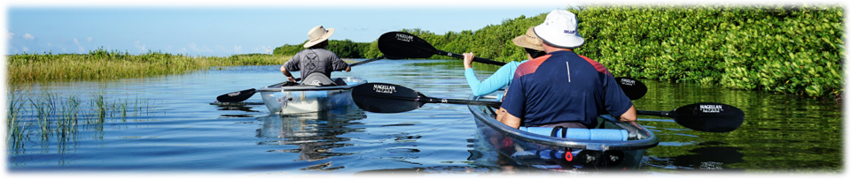

<h2 style = 'text-align: center;'>WELCOME TO THE TAMPA BAY FIB DASHBOARD!</h2>
            
  
 
            
This dashboard summarizes fecal indicator bacteria (FIB) data for a baywide assessment and for data collected as part of the Environmental Protection Commission of Hillsborough County (EPCHC) monitoring program.  The latter is specific to evaluating fecal impairments in the Hillsborough and Alafia river basins.  The assessments are meant to inform progress remediating fecal impairments or to support prioritization of areas for further investigation. They are not meant to support beach monitoring efforts or closures for recreational uses - alternative reporting products are available for that purpose (see <a href='https://www.floridahealth.gov/environmental-health/beach-water-quality/county-detail.html?County=Pinellas&Zip=33701-3109' target = '_blank'>FLDOH Healthy Beaches</a> and <a href='https://pinellas.wateratlas.usf.edu/maps/coastal-water-quality-map/' target='_blank'>Pinellas County Recreational Water Quality Map</a>). The dashboard is organized in the following sections:
            
1) [__BAYWIDE__](#baywide): View baywide summaries of *Enterococcus* data at select monitoring locations for each bay segment
1) [__HILLSBOROUGH COUNTY__](#hillsborough-county): View summaries of Environmental Protection Commission of Hillsborough County (EPCHC) FIB data for the Hillsborough and Alafia River basins
1) [__MANATEE COUNTY__](#manatee-county): View summaries of Manatee County FIB data for select monitoring locations
1) [__DATA DOWNLOADS__](#data-downloads): Download baywide, Hillsborough County, or Manatee County data
                    
The plots in this dashboard are interactive and display options can be controlled using a mouse. Most plots include a <a href='https://help.plot.ly/zoom-pan-hover-controls/' target='_blank'>control menu</a> on the top with different options for viewing the data.  For example, click the camera icon to download a plot.
                    
   
 

<h2 style = 'text-align: center;'>DATA SOURCES</h2>
                      
Source data used on this website were obtained from multiple sources for the baywide assessment and from the Environmental Protection Commission of Hillsborough County. Data can be obtained using functions from the tbeptools R package described below. Graphics and tables provided on the dashboard are made available for exploratory purposes only.  
                    
<h2 style = 'text-align: center;'>WEBSITE INFO</h2>
                      

                      
The page source content can be viewed on <a href='https://github.com/tbep-tech/fib-dash' target='_blank'>Github</a>. Nearly all of the data, tables, and plots were created using functions in the <a href='https://tbep-tech.github.io/tbeptools' target='_blank'>tbeptools</a> R software package.  Please see the <a href='https://tbep-tech.github.io/tbeptools/articles/fib.html' target='_blank'>vignette</a> for a detailed overview of how you can use these functions on your own to work with the data. 
                    
Questions and comments about the dashboard can be sent to [Marcus Beck](mailto:mbeck@tbep.org). Like this app? Share it on social media using the <a href='https://twitter.com/hashtag/TampaBayOpenSci?src=hashtag_click' target='_blank'>#TampaBayOpenSci</a> hashtag.  
                      
Citation info here: 
                      
&nbsp;&nbsp;This website is licensed under a <a rel='license' href='http://creativecommons.org/licenses/by/4.0/' target='_blank'>Creative Commons Attribution 4.0 International License</a>.

